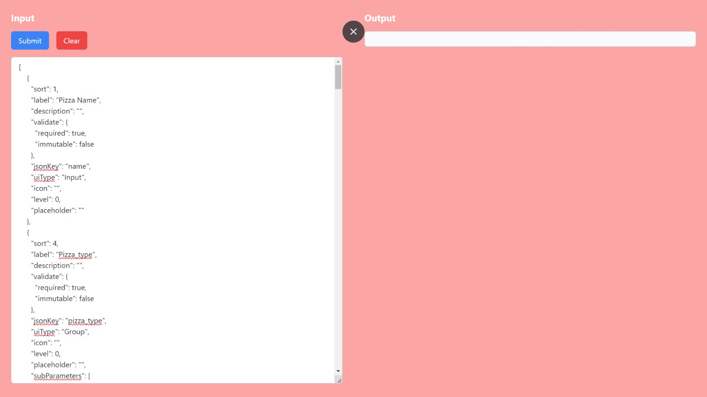
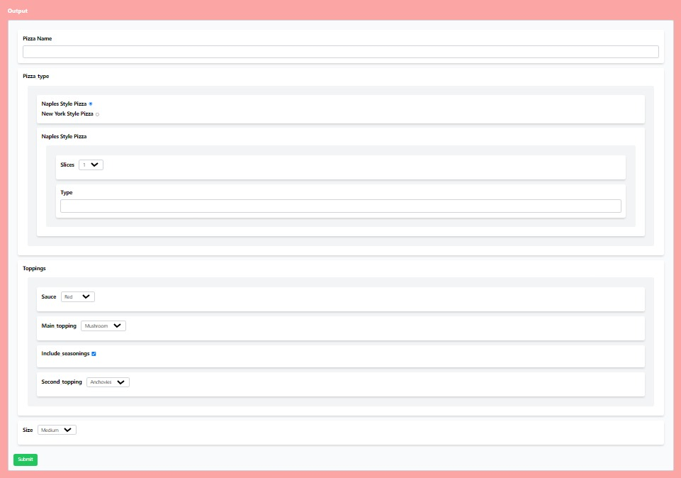
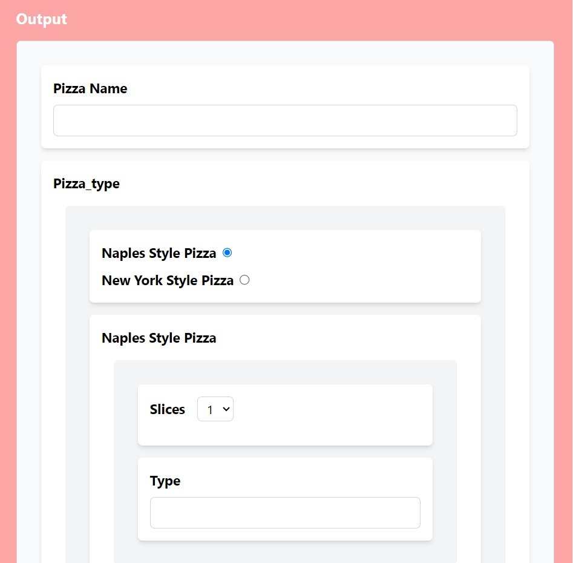
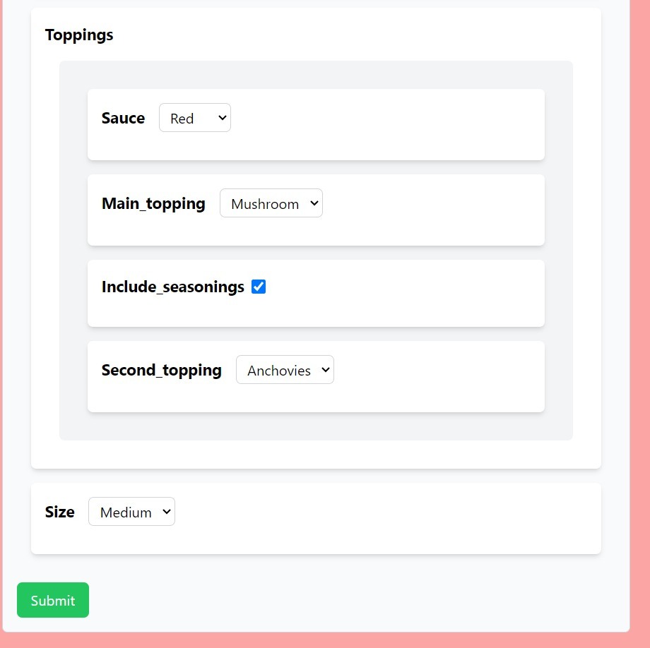
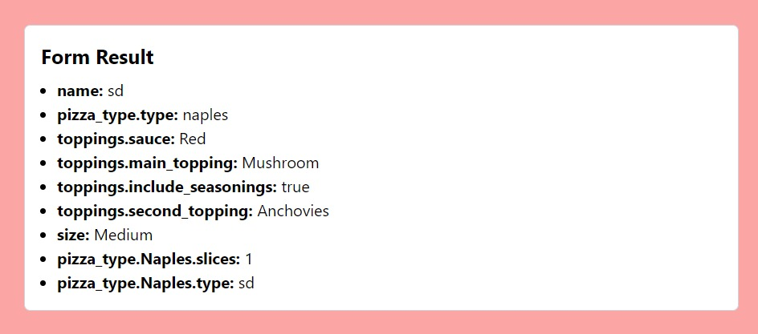
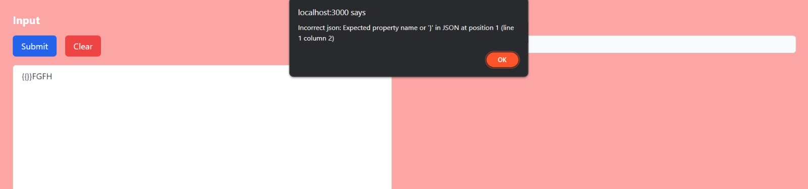

# UI-Schema Frontend Assignment

[Vercel Deployed](https://frontend-assignment-junith.vercel.app/)

### Running in Localhost:      

1. Clone the Repo: `git clone https://github.com/Junith-K/Frontend-Assignment.git`

2. Install Dependencies: `npm i`

3. Run in Local Server: `npm start`

### Usage:

1. Provide the array of objects with the format given in the JSON provided in the Drive Link or just paste the JSON from here: [pizza.json](https://drive.google.com/file/d/1RUU_ueF9BbQRLReuX88w8PWe2jsz3Z3C/view)

2. Click on Submit to show the form generated

3. Enter your data and submit the form to view the Data

4. Error in input text area will show this:

